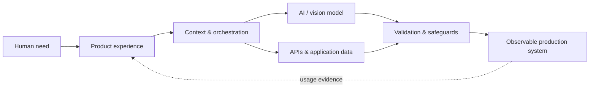

<div align="center">


<br /><br />


### I build intelligent products from model to deployment.

`AI SYSTEMS` · `COMPUTER VISION` · `INTERACTIVE WEB` · `CLOUD & INFRASTRUCTURE`

<br />

[](https://rabbiya-ai-chat.rabiii4046.chatgpt.site/)
[](https://rabbiya-web-gallery.com/)
[](https://www.linkedin.com/in/rabbiya-jehangir/)
[](mailto:rabiii4046@gmail.com)

<br />

[`AI TWIN`](#-talk-to-my-ai-twin) ·
[`IDENTITY`](#-identity-kernel) ·
[`CAPABILITIES`](#-capability-constellation) ·
[`PROJECTS`](#-flagship-systems) ·
[`ARCHITECTURE`](#-how-i-engineer-intelligence) ·
[`EXPERIENCE`](#-experience-signal) ·
[`STACK`](#-technology-command-deck) ·
[`CONNECT`](#-open-a-channel)

</div>

---

## 🪞 Talk to my AI twin

<table>
<tr>
<td width="64%" valign="middle">

### A living interface to my work

My AI assistant can answer questions about my **background, engineering approach, skills, projects, experience, and collaboration fit**—without making you search through the entire profile.

Try asking:

- `Which project best demonstrates Rabbiya's computer-vision skills?`
- `How does Rabbiya connect AI models to production systems?`
- `Is Rabbiya a good fit for an AI, web, or infrastructure role?`
- `What could we build together?`

</td>
<td width="36%" align="center" valign="middle">

### `R.AI / LIVE`

[](https://rabbiya-ai-chat.rabiii4046.chatgpt.site/)

`AVAILABLE 24/7`<br />
`CONTEXT: PROFESSIONAL`<br />
`INTERFACE: CONVERSATIONAL`

</td>
</tr>
</table>

> **Why a link instead of an embedded window?** GitHub safely blocks interactive scripts and iframes inside profile READMEs. This launch interface opens the full live assistant.

---

## 🧬 Identity kernel

<table>
<tr>
<td width="31%" align="center" valign="top">


### Rabbiya Jehangir

**Computer Engineer**<br />
**AI & Product Builder**

`BS COMPUTER ENGINEERING`<br />
Institute of Space Technology<br />
Class of 2024 · CGPA 3.59/4.00

</td>
<td width="69%" valign="top">

```yaml
profile:
  mindset: systems thinker with a product instinct
  strength: connecting intelligence to usable interfaces
  domains:
    - artificial intelligence
    - computer vision
    - production web engineering
    - cloud and infrastructure
  principles:
    - human-centered
    - explainable
    - privacy-aware
    - performance-minded
  objective: turn ambitious ideas into dependable systems
```

### My engineering thesis

> A model is only one component of an intelligent product. The real system includes the interface, context, APIs, data, security, latency, infrastructure, failure modes, and the human making the request.

</td>
</tr>
</table>

---

## ✦ Capability constellation

<div align="center">

```text
                         ┌───────────────────┐
                         │  HUMAN PROBLEM    │
                         └─────────┬─────────┘
                                   │
          ┌────────────────────────┼────────────────────────┐
          ▼                        ▼                        ▼
   ┌─────────────┐          ┌─────────────┐          ┌─────────────┐
   │  PERCEPTION │          │  REASONING  │          │  EXPERIENCE │
   │ Vision / CV │          │ AI / LLMs   │          │ Web / UX    │
   └──────┬──────┘          └──────┬──────┘          └──────┬──────┘
          └────────────────────────┼────────────────────────┘
                                   ▼
                         ┌───────────────────┐
                         │ PRODUCTION SYSTEM │
                         │ APIs · Data · Ops │
                         └───────────────────┘
```

</div>

| Vector | What I work with | Value created |
|---|---|---|
| **01 · Perceive** | Object detection, tracking, gestures, landmarks, image processing | Convert camera and image input into useful signals |
| **02 · Reason** | LLM applications, RAG concepts, neural networks, explainability, prompt systems | Turn information into contextual, structured assistance |
| **03 · Experience** | React, JavaScript, Three.js, responsive UX, WordPress | Make complex technology feel clear and approachable |
| **04 · Connect** | REST APIs, databases, authentication, integrations | Join intelligence with real business and application data |
| **05 · Operate** | Hosting, DNS, SSL, CDN, caching, backups, monitoring | Keep products fast, secure, recoverable, and available |

---

## 🚀 Flagship systems

### `01 / AIRDRIVE RACING` — when vision becomes control

<table>
<tr>
<td width="25%" align="center">

## 🏎️ → 🖐️

`REAL-TIME VISION`


</td>
<td width="75%">

#### Gesture-controlled 3D racing in the browser

A futuristic endless-highway racer that translates live hand poses into steering, acceleration, braking, nitro, and drift.

**Engineering signature:** separates hand detection from the render loop; adds calibration, landmark feedback, lost-hand pause, keyboard/touch fallback, reduced motion, and quality controls.

`React 19` `TypeScript` `Three.js` `MediaPipe` `WebGL` `Web Audio`

[](https://github.com/rabiyajeh/AirDrive-Racing)

</td>
</tr>
</table>

<br />

### `02 / NEUROCIRCUIT-AI` — when hypotheses become evidence

<table>
<tr>
<td width="75%">

#### Reproducible neural-circuit experimentation

A research platform for testing how controlled circuit-level perturbations affect attention and working memory in a biologically constrained recurrent neural network.

**Research signature:** matched controls, rescue curves, uncertainty intervals, paired effects, multiple-comparison correction, frozen configurations, checksums, and explicit ethical boundaries.

`Python` `RNNs` `Explainable AI` `Statistics` `Streamlit` `Research Automation`

[](https://github.com/rabiyajeh/neurocircuit-ai)

</td>
<td width="25%" align="center">

## 🧠 → 📊

`EVIDENCE ENGINE`


</td>
</tr>
</table>

<br />

### `03 / AI PYTUTOR` — when confusion becomes a learning path

<table>
<tr>
<td width="25%" align="center">

## 🎓 → 💡

`AI EDTECH`


</td>
<td width="75%">

#### An AI-powered path into Python and artificial intelligence

A beginner-friendly learning product combining structured roadmaps, explanations, practice, homework support, interview preparation, and project guidance.

**Product signature:** reduces the “too many tabs, no clear direction” problem through visible progression and learner-centered next actions.

`AI Product Development` `EdTech` `Python Learning` `LLM Applications` `UX`

[](https://ai-pytutor.com/)

</td>
</tr>
</table>

<details>
<summary><b>Expand the experimental network</b></summary>
<br />

| Node | Experiment | Signal |
|:---:|---|---|
| `E-01` | [**MemeFace Synth**](https://github.com/rabiyajeh/memeface-synth) | Facial expression as an audiovisual instrument |
| `E-02` | [**60 Days of Python**](https://github.com/rabiyajeh/python-60-days) | Consistent learning through daily builds |
| `E-03` | **Jet Detection & Tracking FYP** | YOLOv6 detection with identity-preserving DeepSORT tracking |
| `E-04` | [**MediQuick**](https://github.com/rabiyajeh/MediQuick) | Falcon-180B integration for accessible healthcare conversation |

</details>

---

## ⚙️ How I engineer intelligence



<table>
<tr>
<td width="25%" valign="top">

### `DISCOVER`

Find the real human or business problem. Define success, limits, users, and risks before choosing technology.

</td>
<td width="25%" valign="top">

### `ARCHITECT`

Place the model, interface, context, API, data, and infrastructure boundaries deliberately.

</td>
<td width="25%" valign="top">

### `PROVE`

Build the smallest convincing version. Test behavior, latency, usability, privacy, and failure states.

</td>
<td width="25%" valign="top">

### `OPERATE`

Deploy securely. Observe real use, recover gracefully, measure honestly, and improve from evidence.

</td>
</tr>
</table>

```http
POST /v1/rabbiya-ai/build
Content-Type: application/json

{
  "input": "ambitious idea",
  "constraints": ["human need", "privacy", "latency", "cost", "reliability"],
  "pipeline": ["discover", "architect", "prototype", "validate", "deploy", "observe"],
  "output": "a useful, working system"
}
```

---

## 🛰️ Infrastructure radar

> I treat infrastructure as part of product behavior—not an afterthought hidden below it.

| Altitude | Systems | Operational concern |
|:---:|---|---|
| `EDGE` | Browser vision · MediaPipe · CDN · cache | Privacy, frame rate, device capability, delivery speed |
| `APP` | FastAPI · Flask · Node.js · PHP · WordPress | Validation, authentication, integration, reliability |
| `DATA` | MySQL · PostgreSQL · MongoDB · Firebase · Supabase | Integrity, access boundaries, query behavior |
| `MODEL` | LLM APIs · PyTorch · TensorFlow · OpenCV | Output quality, latency, quotas, compute |
| `OPS` | Cloudflare · cPanel · Hostinger · Vercel · Docker basics | SSL, DNS, monitoring, backups, recovery |

<div align="center">

`PERFORMANCE` ◉━━━━━━━ `SECURITY` ◉━━━━━━━ `RESILIENCE` ◉━━━━━━━ `OBSERVABILITY`

</div>

---

## 📡 Experience signal

```text
2025 ─────────────── NOW
  J.K Media Digital Marketing
  WordPress Developer
  ↳ production websites · integrations · performance · security · maintenance

2024 ─────────────── FOUNDATION COMPLETE
  Institute of Space Technology, Islamabad
  BS Computer Engineering · CGPA 3.59/4.00
  ↳ AI · image processing · networks · architecture · embedded foundations

LEADERSHIP ────────── OPERATIONS
  GAO Tek / GAO RFID
  Former Assistant Tech Manager
  ↳ remote coordination · mentoring · workflows · delivery quality
```

| Environment | Problems handled | Signal strengthened |
|---|---|---|
| **Production web** | E-commerce, lead systems, responsive delivery, performance, security | Ownership · debugging · UX · reliability |
| **AI & research** | Vision, tracking, neural modeling, uncertainty, reproducibility | Experimental reasoning · evidence · communication |
| **Remote leadership** | Intern coordination, mentoring, quality checks | Guidance · process design · accountability |
| **Computer engineering** | Cross-layer software and hardware systems | Systems thinking · technical range · rigor |

---

## 🎛️ Technology command deck

<div align="center">


</div>

<details open>
<summary><b>🧠 Intelligence & perception</b></summary>
<br />

`Python` `OpenCV` `YOLOv6` `DeepSORT` `MediaPipe` `PyTorch` `TensorFlow/Keras` `scikit-learn` `Pandas` `NumPy`

Computer vision · object detection · multi-object tracking · gestures · neural systems · explainable experiments

</details>

<details>
<summary><b>💬 Conversational systems</b></summary>
<br />

`LLM APIs` `RAG Concepts` `Prompt Architecture` `Vector Search Concepts` `Falcon-180B Integration`

Conversational UX · context design · model integration · structured output · safeguards · fallbacks

</details>

<details>
<summary><b>🌐 Product engineering</b></summary>
<br />

`React` `TypeScript` `JavaScript` `Next.js` `Three.js` `WebGL` `Node.js` `Express` `FastAPI` `Flask` `REST APIs`

Responsive interfaces · interactive 3D · browser AI · backend services · authentication · API-driven products

</details>

<details>
<summary><b>🛡️ Production & operations</b></summary>
<br />

`WordPress` `WooCommerce` `PHP` `MySQL` `Cloudflare` `cPanel` `Hostinger` `Vercel` `Docker Basics`

Deployment · DNS · SSL · CDN · caching · backups · security hardening · recovery · Core Web Vitals

</details>

---

## 🔭 Current trajectory

<table>
<tr>
<td width="33%" valign="top">

### Exploring

`Computer Vision`<br />
`LLM Applications`<br />
`Explainable AI`

Building deeper understanding of intelligent systems that remain observable and understandable.

</td>
<td width="33%" valign="top">

### Shipping

`Production Web`<br />
`API Integrations`<br />
`Performance & Security`

Turning requirements into responsive, maintainable, reliable experiences.

</td>
<td width="33%" valign="top">

### Expanding

`Cloud Infrastructure`<br />
`Data-Center Systems`<br />
`Edge AI`

Growing from application delivery toward scalable compute and inference operations.

</td>
</tr>
</table>

<details>
<summary><b>Research direction</b></summary>
<br />

My graduate research interest centers on **uncertainty-aware visual-inertial fusion for multi-object tracking in GPS-denied UAV search-and-rescue missions**—connecting probabilistic detection, ego-motion compensation, robust data association, and resource-aware edge deployment.

</details>

---

## 📈 Live engineering telemetry

<div align="center">


<br />


<br />


</div>

---

## 🌐 Production network

| Node | Product | Domain | Route |
|:---:|---|---|:---:|
| `01` | **Rabbiya Web Gallery** | Personal brand and project storytelling | [Launch ↗](https://rabbiya-web-gallery.com/) |
| `02` | **ACRD Projects** | Real estate and business presentation | [Launch ↗](https://acrdprojects.com/) |
| `03` | **Zoya Venture Real Estate** | Listings-focused responsive UX | [Launch ↗](https://zoyaventurerealestate.com/) |
| `04` | **House of Paints** | WooCommerce and performance | [Launch ↗](https://house-of-paints.com/) |
| `05` | **OrangeFlow365** | Conversion-focused services | [Launch ↗](https://orangeflow365.com/) |
| `06` | **Crafted Bonds** | Brand-led jewelry commerce | [Launch ↗](https://craftedbonds.com/) |
| `07` | **Xzlon** | Modern software services | [Launch ↗](https://xzlon.com/) |

---

## 📬 Open a channel

<table>
<tr>
<td width="62%" valign="top">

```json
{
  "status": "open_to_opportunities",
  "best_fit": [
    "AI and computer-vision products",
    "intelligent web experiences",
    "production engineering",
    "research collaboration"
  ],
  "collaboration": ["remote roles", "freelance", "research", "hackathons"],
  "next_action": "start a conversation"
}
```

</td>
<td width="38%" align="center" valign="middle">

[](https://rabbiya-ai-chat.rabiii4046.chatgpt.site/)

[](https://www.linkedin.com/in/rabbiya-jehangir/)

[](mailto:rabiii4046@gmail.com)

[](https://www.upwork.com/freelancers/rabbiyaj)

[](https://orcid.org/0009-0000-5115-8359)

</td>
</tr>
</table>

<div align="center">

### `HUMAN-CENTERED INTELLIGENCE · PRODUCTION-MINDED ENGINEERING`


```text
> SESSION STATUS: READY
> INPUT: an ambitious idea
> OUTPUT: a clear, useful, working system
> NEXT: connect · collaborate · build
```


</div>
