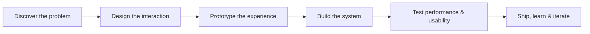

<p align="center">
  
</p>

<div align="center">

# Hi, I'm Rabbiya 👩‍💻✨

### I build intelligent, interactive products where AI, creative coding, and modern web engineering meet.


[](https://rabbiya-web-gallery.com/)
[](https://linkedin.com/in/rabbiya-jehangir-8b0a831ab)
[](mailto:rabiii4046@gmail.com)
[](https://www.upwork.com/freelancers/rabbiyaj)


</div>

---

## About me

I'm a Computer Engineering graduate and developer from Rawalpindi, Pakistan. My background is in building polished, business-ready websites with WordPress, WooCommerce, PHP, JavaScript, and modern frontend tools.

Today, I am expanding that foundation into **creative AI and interactive computing**—building computer-vision interfaces, gesture-controlled experiences, browser-based 3D products, explainable experiments, and practical Python systems.

- 🔭 Building playful, intelligent experiences with **React, TypeScript, Three.js, MediaPipe, and Python**
- 🧠 Exploring **computer vision, human-computer interaction, AI, and computational neuroscience**
- 🌐 Experienced in **WordPress, WooCommerce, Elementor, responsive UI, SEO, and performance**
- 🎨 Interested in products that combine **strong engineering with memorable visual design**
- 🤝 Open to creative development, web, AI, and remote freelance opportunities

---

## Current direction

<table>
<tr>
<td width="25%" align="center">

### 👁️ Perception

Real-time hand and face tracking with privacy-conscious, on-device inference.

</td>
<td width="25%" align="center">

### 🕹️ Interaction

Natural interfaces that turn human gestures into responsive digital controls.

</td>
<td width="25%" align="center">

### 🧠 Intelligence

Explainable AI, neural experiments, LLM applications, and learning systems.

</td>
<td width="25%" align="center">

### ✨ Experience

Immersive 3D environments, expressive motion, sound, and premium visual design.

</td>
</tr>
</table>

---

## Featured projects

<table>
<tr>
<td width="50%" valign="top">

### 🏎️ [AirDrive Racing](https://github.com/rabiyajeh/AirDrive-Racing)

A futuristic browser-based 3D racing game controlled through real-time webcam hand gestures or a keyboard.

**Highlights:** two-hand steering, gesture-based acceleration and braking, nitro and drift recognition, procedural traffic, privacy-first local camera processing, responsive controls.

`React 19` `TypeScript` `Three.js` `MediaPipe` `Web Audio API`

</td>
<td width="50%" valign="top">

### 🎛️ [MemeFace Synth](https://github.com/rabiyajeh/memeface-synth)

A playful creative-computing experiment that turns facial expressions and hand gestures into a real-time synthesizer and arcade experience.

**Focus:** expressive interfaces, computer vision, browser interaction, sound, and playful technology.

`Computer Vision` `Gesture Interaction` `Creative Coding` `Web Audio`

</td>
</tr>
<tr>
<td width="50%" valign="top">

### 🧠 [NeuroCircuit AI](https://github.com/rabiyajeh/neurocircuit-ai)

Explainable excitatory/inhibitory recurrent-circuit perturbation experiments for delayed-attention tasks.

**Focus:** interpretable experiments, neural dynamics, scientific visualization, and research-oriented AI.

`Python` `Neural Circuits` `Explainable AI` `Data Visualization`

</td>
<td width="50%" valign="top">

### 🐍 [60 Days of Python](https://github.com/rabiyajeh/python-60-days)

A growing collection of daily Python practice tasks and projects documenting consistent, hands-on learning.

**Focus:** problem-solving, Python fundamentals, experimentation, and project-based growth.

`Python` `Jupyter Notebook` `Learning in Public`

</td>
</tr>
</table>

<div align="center">

[](https://github.com/rabiyajeh/AirDrive-Racing)
[](https://github.com/rabiyajeh/neurocircuit-ai)

</div>

---

## From idea to working product



I enjoy working across the full product loop: shaping the concept, designing the interface, building the technical core, handling edge cases, and refining the final experience.

---

## Selected production web work

| Project | Type | Link |
|---|---|---|
| **AI PyTutor** | AI learning platform | [Visit](https://ai-pytutor.com/) |
| **Rabbiya Web Gallery** | Developer portfolio | [Visit](https://rabbiya-web-gallery.com/) |
| **ACRD Projects** | Business website | [Visit](https://acrdprojects.com/) |
| **OrangeFlow365** | Service website | [Visit](https://orangeflow365.com/) |
| **Crafted Bonds** | Jewelry brand website | [Visit](https://craftedbonds.com/) |
| **Zoya Venture Real Estate** | Real-estate website | [Visit](https://zoyaventurerealestate.com/) |
| **Xzlon** | Software-house website | [Visit](https://xzlon.com/) |

---

## Engineering toolkit

<div align="center">


</div>

| Area | Tools and interests |
|---|---|
| **Creative & intelligent web** | React, TypeScript, Three.js, MediaPipe, Web APIs, computer vision |
| **AI & experimentation** | Python, Jupyter, explainable AI, LLMs, RAG, data visualization |
| **Web development** | WordPress, WooCommerce, Elementor, PHP, JavaScript, responsive design |
| **Backend & data** | Laravel, REST APIs, MySQL, Supabase, Firebase |
| **Delivery & quality** | Git, GitHub, Docker, Postman, SEO, accessibility, Core Web Vitals |

---

## What I'm exploring now

```text
Creative AI              → expressive, playful, human-centered tools
Computer vision          → gesture and facial-expression interfaces
Interactive 3D web       → immersive browser experiences with Three.js
Explainable systems      → understandable AI and neural-circuit experiments
Python engineering       → stronger foundations through daily practice
AI product development   → useful learning tools, agents, LLMs, and RAG
```

---

## Development snapshot

<div align="center">


<br />


<br />


</div>

---

## Open to

| Opportunity | What I bring |
|---|---|
| **Creative developer roles** | Interaction design, experimental interfaces, 3D web, visual polish |
| **AI and computer-vision projects** | Gesture experiences, Python experiments, explainable prototypes |
| **Frontend and full-stack work** | React, TypeScript, APIs, databases, responsive product interfaces |
| **WordPress and WooCommerce builds** | Business websites, stores, performance, SEO, and client delivery |
| **Research and hackathon collaboration** | Fast prototyping, interdisciplinary thinking, technical storytelling |

---

<div align="center">

### Let's build something useful, expressive, and a little unexpected.

[Portfolio](https://rabbiya-web-gallery.com/) •
[GitHub](https://github.com/rabiyajeh) •
[LinkedIn](https://linkedin.com/in/rabbiya-jehangir-8b0a831ab) •
[Email](mailto:rabiii4046@gmail.com) •
[Blog](https://learn-frontenddev.blogspot.com/)

<br />

`Creative ideas • thoughtful interfaces • strong execution`

</div>

<p align="center">
  
</p>
