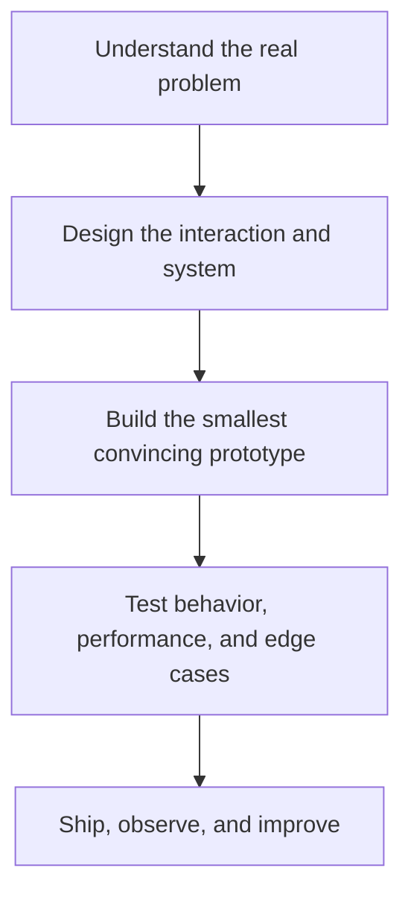

<p align="center">
  
</p>

<div align="center">

# Hi, I'm Rabbiya 👩‍💻

### I turn ambitious ideas into intelligent, interactive, and production-ready digital products.


[](https://rabbiya-web-gallery.com/)
[](https://www.linkedin.com/in/rabbiya-jehangir/)
[](mailto:rabiii4046@gmail.com)
[](https://www.upwork.com/freelancers/rabbiyaj)


</div>

---

## The short version

I'm a **Computer Engineering graduate from the Institute of Space Technology** and a developer who works across **AI, computer vision, interactive web engineering, and production WordPress development**.

My experience spans two complementary worlds:

- building reliable websites, stores, integrations, and business experiences for real clients; and
- experimenting with gesture interfaces, browser-based 3D, explainable neural systems, and AI-powered learning products.

I care about the complete product—not only whether the code runs, but whether the interaction feels natural, the system is understandable, privacy is respected, and the final result is useful.

<table>
<tr>
<td width="33%" valign="top">

### 👁️ Perception

Real-time computer vision, gesture and facial-expression interfaces, object detection, and multi-object tracking.

</td>
<td width="33%" valign="top">

### 🧠 Intelligence

Explainable experiments, recurrent neural systems, LLM applications, RAG, and learning-focused AI products.

</td>
<td width="33%" valign="top">

### ✨ Product engineering

React and 3D web experiences, WordPress and WooCommerce systems, APIs, databases, performance, and deployment.

</td>
</tr>
</table>

---

## Flagship work

### 🏎️ AirDrive Racing — gesture-controlled 3D racing in the browser

> A futuristic endless highway racer controlled with live hand gestures, a keyboard, or both.

[](https://github.com/rabiyajeh/AirDrive-Racing)


**Engineering highlights**

- Converts two-hand poses into steering, acceleration, braking, nitro, and drift controls.
- Separates real-time hand detection from the render loop for responsive interaction.
- Generates a procedural Three.js highway with traffic, collectibles, collisions, scoring, and difficulty progression.
- Processes camera frames locally with MediaPipe—no recording, upload, account, or backend required.
- Includes calibration, landmark feedback, lost-hand safety pause, keyboard/hybrid/touch fallbacks, reduced motion, and quality controls.

`React 19` `TypeScript` `Three.js` `MediaPipe Tasks Vision` `Web Audio API` `WebGL`

---

### 🧠 NeuroCircuit-AI — reproducible neural-circuit hypothesis testing

> A research platform for studying how controlled circuit-level perturbations affect attention and working memory in a biologically constrained recurrent neural network.

[](https://github.com/rabiyajeh/neurocircuit-ai)


**Engineering highlights**

- Implements a continuous-time rate RNN with an 80/20 excitatory/inhibitory split and structural Dale-style sign constraints.
- Supports controlled perturbation sweeps, matched controls, bounded rescue curves, calibration, internal-state analysis, and delay generalization.
- Treats independent network seeds as replication units and produces uncertainty intervals, paired effects, effect sizes, Holm correction, and interaction tests.
- Preserves evidence provenance through frozen configurations, checksums, versioned artifacts, saved metrics, and automatic research reports.
- Includes a read-only Streamlit explorer and explicit ethical boundaries against diagnostic or patient-level claims.

`Python` `Recurrent Neural Networks` `Explainable AI` `Statistics` `Streamlit` `Reproducible Research`

---

### 🎓 AI PyTutor — a clearer path into Python and AI

> A free AI-powered learning platform designed to help beginners move from confusion to structured, practical progress.

[](https://ai-pytutor.com/)
[](https://www.linkedin.com/posts/rabbiya-jehangir-8b0a831ab_ai-pytutor-learn-python-ai-data-science-activity-7480686513828249600-HWcu)

**Product focus**

- Brings roadmaps, practice, explanations, homework support, and project guidance into one learner-friendly experience.
- Reduces the “too many tabs, no clear next step” problem that slows down new AI learners.
- Combines educational UX, practical AI assistance, and iterative product development.

`AI Product Development` `EdTech` `Python Learning` `LLM Applications` `User-Centered Design`

---

### More experiments

| Project | What it explores | Stack / focus |
|---|---|---|
| [**MemeFace Synth**](https://github.com/rabiyajeh/memeface-synth) | Turning facial expressions and gestures into a playful audiovisual interface | Creative coding, computer vision, Web Audio |
| [**60 Days of Python**](https://github.com/rabiyajeh/python-60-days) | Consistent learning through daily tasks and small projects | Python, problem-solving, learning in public |
| **Jet Detection & Tracking FYP** | Real-time aircraft detection and identity-preserving tracking | YOLOv6, DeepSORT, OpenCV, computer vision |

---

## Professional journey

| Chapter | Focus | What I developed |
|---|---|---|
| **WordPress Developer — J.K Media Digital Marketing** | Production websites, stores, real-estate systems, performance, SEO, and client delivery | Business-focused engineering, debugging, integrations, responsive UX, ownership |
| **Former Assistant Tech Manager — GAO Tek / GAO RFID** | International intern coordination, WordPress content and product workflows, mentoring | Leadership, communication, remote collaboration, process management |
| **BS Computer Engineering — IST, 2024** | Software, hardware, intelligent systems, signal and image processing | Strong cross-disciplinary engineering foundation |
| **Current AI direction** | Computer vision, human-computer interaction, explainable systems, computational neuroscience | Research thinking, experimental design, scientific communication |

---

## Selected production web work

| Product | Domain | Contribution |
|---|---|---|
| [**Rabbiya Web Gallery**](https://rabbiya-web-gallery.com/) | Personal brand | Portfolio architecture, project storytelling, responsive experience |
| [**ACRD Projects**](https://acrdprojects.com/) | Real estate / business | Responsive delivery, performance, business presentation |
| [**Zoya Venture Real Estate**](https://zoyaventurerealestate.com/) | Real estate | Listings-focused experience and responsive implementation |
| [**House of Paints**](https://house-of-paints.com/) | E-commerce | WooCommerce experience and performance optimization |
| [**OrangeFlow365**](https://orangeflow365.com/) | Services | Conversion-focused business website |
| [**Crafted Bonds**](https://craftedbonds.com/) | Jewelry / e-commerce | Brand-led shopping experience |
| [**Xzlon**](https://xzlon.com/) | Software services | Modern software-house landing experience |

---

## Engineering toolkit

<div align="center">


</div>

| Area | Technologies and methods |
|---|---|
| **AI & computer vision** | Python, OpenCV, YOLOv6, DeepSORT, MediaPipe, PyTorch, TensorFlow/Keras, scikit-learn |
| **Generative AI** | LLM applications, RAG, LangChain/LangGraph concepts, vector search, prompt engineering |
| **Interactive web** | React, TypeScript, Next.js, Three.js, WebGL, Web Audio, responsive UI, accessibility |
| **Production web** | WordPress, WooCommerce, Elementor, PHP, ACF, custom integrations, SEO, Core Web Vitals |
| **Backend & data** | Node.js, Express, FastAPI, Flask, Laravel, REST APIs, MySQL, PostgreSQL, MongoDB, Supabase, Firebase |
| **Delivery** | Git/GitHub, Docker, Postman, Vercel, cPanel, Hostinger, Cloudflare, debugging and optimization |

---

## How I approach a build



My default is to make the hard parts visible: assumptions, fallbacks, privacy boundaries, performance constraints, failure cases, and evidence behind important claims.

---

## Current research and build radar

```text
Human-computer interaction  → camera-based controls that feel natural
Creative computer vision    → expressive gesture and facial interfaces
Interactive 3D web          → immersive products that run in the browser
Explainable AI              → systems whose behavior can be inspected
Computational neuroscience  → careful, bounded neural-circuit experiments
AI learning products        → guidance that turns curiosity into progress
```

---

## GitHub signal

<div align="center">


<br />


<br />


</div>

---

## Contribution journey

<div align="center">

<picture>
  <source media="(prefers-color-scheme: dark)" srcset="https://raw.githubusercontent.com/rabiyajeh/rabiyajeh/output/github-contribution-grid-snake-dark.svg" />
  <source media="(prefers-color-scheme: light)" srcset="https://raw.githubusercontent.com/rabiyajeh/rabiyajeh/output/github-contribution-grid-snake.svg" />
  
</picture>

</div>

---

## Let's build together

I'm open to work where **technical depth and user experience matter at the same time**:

- AI, computer-vision, and human-computer interaction projects
- creative frontend, interactive 3D, and full-stack product work
- WordPress, WooCommerce, performance, and custom integration projects
- research prototypes, hackathons, and interdisciplinary collaborations
- remote development and freelance opportunities

<div align="center">

### Have an idea that deserves more than an ordinary interface?

[](https://rabbiya-web-gallery.com/)
[](https://github.com/rabiyajeh)
[](https://www.linkedin.com/in/rabbiya-jehangir/)
[](mailto:rabiii4046@gmail.com)
[](https://orcid.org/0009-0000-5115-8359)

<br />

`Thoughtful systems • expressive interfaces • useful outcomes`

</div>

<p align="center">
  
</p>
