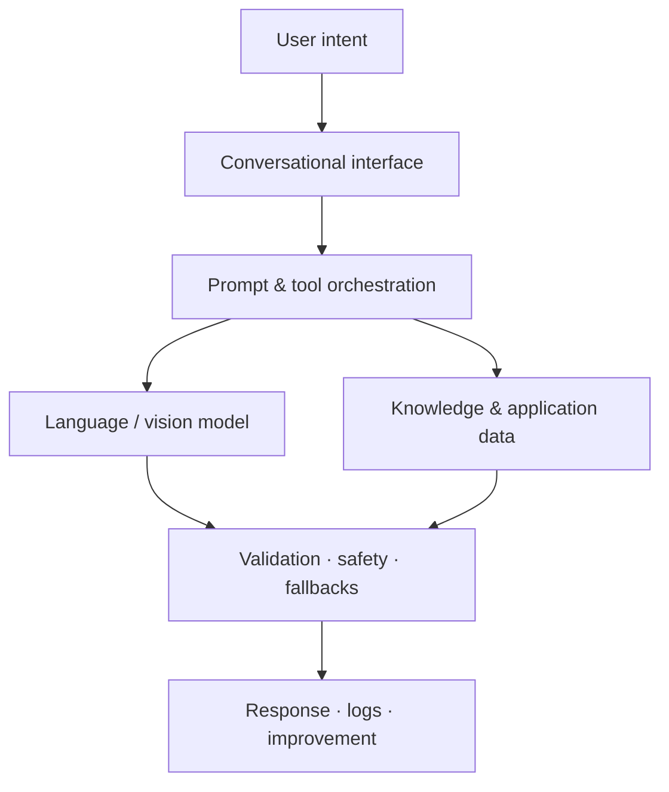
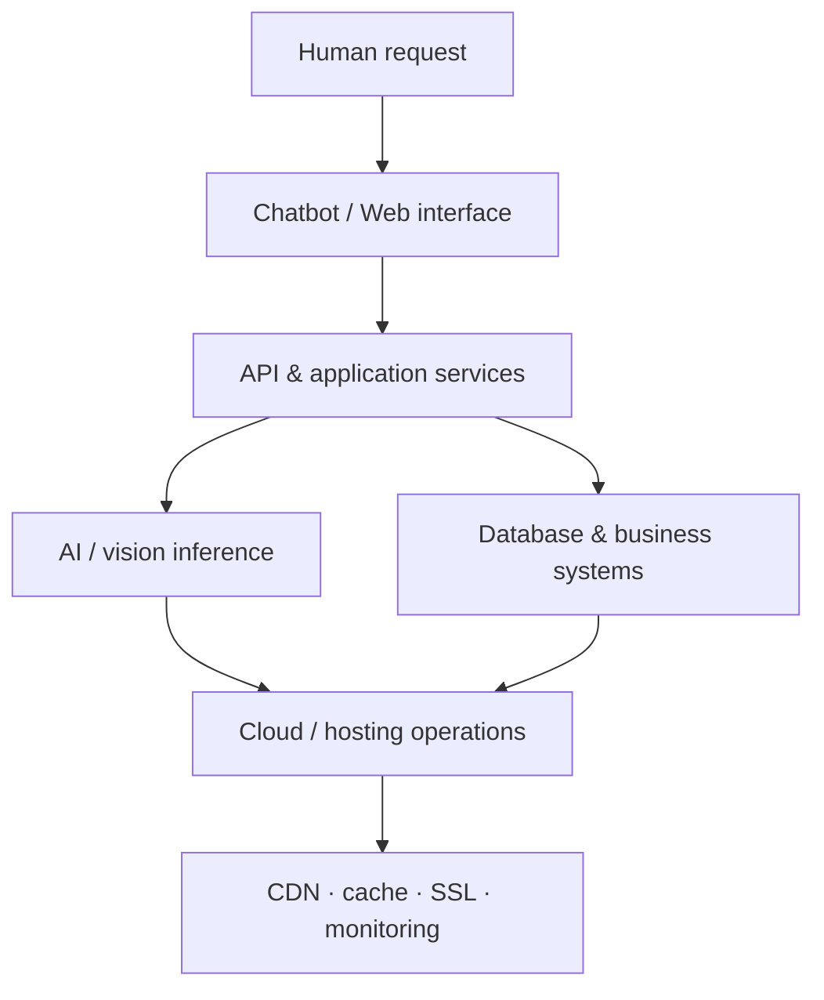
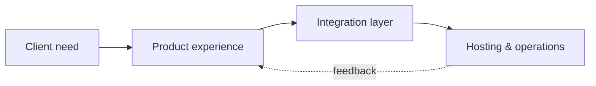
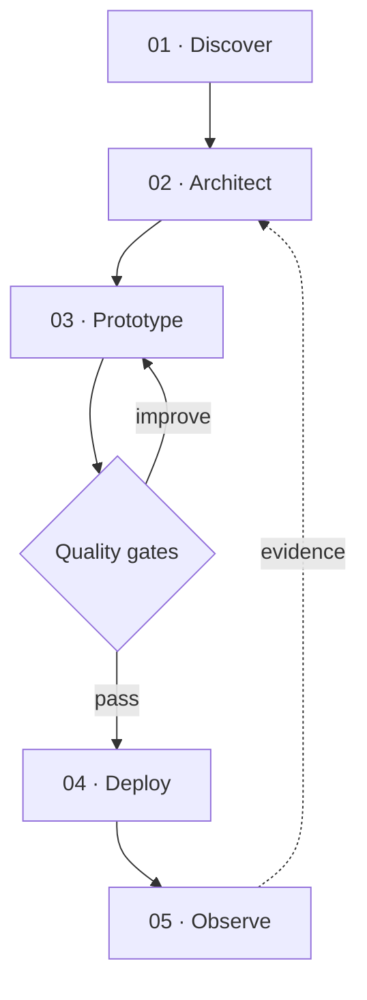

<div align="center">


<p>
  
  
  
  
</p>


<br />

[](https://rabbiya-web-gallery.com/)
[](https://www.linkedin.com/in/rabbiya-jehangir/)
[](mailto:rabiii4046@gmail.com)
[](https://www.upwork.com/freelancers/rabbiyaj)

<br />

[`CHAT`](#ask-rabbiyaai) ·
[`SYSTEM`](#system-profile) ·
[`ENGINE`](#ai-conversation-engine) ·
[`MODELS`](#deployed-projects) ·
[`INFRA`](#infrastructure--data-center-layer) ·
[`EXPERIENCE`](#experience-log) ·
[`STACK`](#technology-matrix) ·
[`TELEMETRY`](#live-developer-telemetry) ·
[`CONNECT`](#open-a-channel)

<br />

<table>
<tr>
<td align="center"><h2>03</h2><sub>INTELLIGENT SYSTEMS</sub></td>
<td align="center"><h2>07</h2><sub>PRODUCTION NODES</sub></td>
<td align="center"><h2>04</h2><sub>OPERATIONAL LAYERS</sub></td>
<td align="center"><h2>01</h2><sub>COMPUTER ENGINEERING DEGREE</sub></td>
</tr>
</table>

<sub><code>BOOT_ID: RJ-2026.07</code> · <code>INTERFACE: HUMAN-CENTERED</code> · <code>RUNTIME: CONTINUOUS-LEARNING</code></sub>

</div>

---

## Ask Rabbiya.AI

<div align="center">

[](#deployed-projects)
[](#ai-conversation-engine)
[](#production-network)
[](#infrastructure--data-center-layer)

</div>

<table>
<tr>
<td width="11%" align="center">

### 👤

**YOU**

</td>
<td>

**What do you build?**

</td>
</tr>
<tr>
<td width="11%" align="center">

### 🤖

**R.AI**

</td>
<td>

I build **AI-powered products, computer-vision systems, interactive browser experiences, and reliable production websites**. My work connects intelligent models with the infrastructure, interfaces, APIs, databases, and deployment layers required to make them useful.

</td>
</tr>
<tr>
<td width="11%" align="center">

### 👤

**YOU**

</td>
<td>

**What makes your approach different?**

</td>
</tr>
<tr>
<td width="11%" align="center">

### 🤖

**R.AI**

</td>
<td>

I think like a computer engineer and build like a product developer: **model behavior, user experience, latency, privacy, hosting, security, and maintainability are all part of the same system**.

</td>
</tr>
</table>

<details>
<summary><b>Try the command palette</b></summary>
<br />

| Command | Response route |
|---|---|
| <kbd>/about</kbd> | Computer-engineering foundation and operator profile |
| <kbd>/models</kbd> | AI, computer-vision, research, and EdTech systems |
| <kbd>/infra</kbd> | Hosting, delivery edge, security, reliability, and deployment |
| <kbd>/experience</kbd> | Production work, leadership, and engineering progression |
| <kbd>/connect</kbd> | Collaboration, opportunities, and direct channels |

</details>

```console
rabbiya@ai-node:~$ status --current
● Exploring      Computer Vision · LLM Applications · Explainable AI
● Shipping       WordPress · WooCommerce · API Integrations · Performance
● Expanding      Cloud Infrastructure · Data-Center Systems · Edge AI
● Principle      Build clearly. Measure honestly. Improve continuously.
```

---

## System profile

<table>
<tr>
<td width="34%" align="center" valign="top">


### Rabbiya Jehangir

`BS COMPUTER ENGINEERING`

Institute of Space Technology  
Islamabad · Class of 2024

</td>
<td width="66%" valign="top">

### Operator metrics

| Signal | Reading |
|---|---|
| **Academic foundation** | BS Computer Engineering · CGPA 3.59/4.00 |
| **Production role** | WordPress Developer · J.K Media Digital Marketing |
| **Leadership chapter** | Former Assistant Tech Manager · GAO Tek / GAO RFID |
| **Core domains** | AI · Computer Vision · Web Engineering · Infrastructure |
| **Build philosophy** | Human-centered · Explainable · Privacy-aware · Performance-minded |
| **Working languages** | Python · JavaScript · PHP · SQL |
| **Current mode** | Converting ambitious ideas into working systems |

> “The best AI experience is not only intelligent—it is fast, understandable, dependable, and designed for the human using it.”

</td>
</tr>
</table>

---

## Neural capability grid

<table>
<tr>
<td width="25%" valign="top">

### 01 · PERCEIVE

`INPUT LAYER`

Computer vision, object detection, multi-object tracking, hand gestures, facial landmarks, image processing, and camera-based interaction.

</td>
<td width="25%" valign="top">

### 02 · REASON

`INTELLIGENCE LAYER`

LLM applications, RAG concepts, neural networks, explainable experiments, prompt systems, and learning-focused AI products.

</td>
<td width="25%" valign="top">

### 03 · CONNECT

`APPLICATION LAYER`

REST APIs, databases, authentication, business integrations, responsive interfaces, real-time browser experiences, and automation.

</td>
<td width="25%" valign="top">

### 04 · OPERATE

`INFRASTRUCTURE LAYER`

Hosting, DNS, SSL, CDN, caching, backups, malware recovery, monitoring, deployment, and production performance.

</td>
</tr>
</table>

---

## AI conversation engine

> An effective chatbot is not a text box attached to a model. It is a complete request-processing system with context, tools, safeguards, latency limits, and measurable output quality.



<table>
<tr>
<td width="25%" valign="top">

### `01 / INTERFACE`

- Clear conversation flows
- Helpful system feedback
- Structured output
- Accessible interaction
- Human handoff paths

</td>
<td width="25%" valign="top">

### `02 / INTELLIGENCE`

- LLM API integration
- Prompt architecture
- Vision input pipelines
- Tool/function routing
- Model-aware fallbacks

</td>
<td width="25%" valign="top">

### `03 / CONTEXT`

- Retrieval concepts
- Session state
- Database integration
- Provenance-aware answers
- Privacy boundaries

</td>
<td width="25%" valign="top">

### `04 / OPERATIONS`

- Latency awareness
- Error handling
- Usage and cost thinking
- Logs and evaluation
- Secure deployment

</td>
</tr>
</table>

#### Chatbot systems I have contributed to

| System | My contribution | Intelligence path | Product objective |
|---|---|---|---|
| **AI PyTutor** | Product direction, learning workflows, AI-assisted features, and learner-centered UX | LLM-assisted educational guidance | Make Python and AI learning easier to navigate |
| **MediQuick** | Team-built hackathon product; integrated the Falcon-180B API and worked on core chatbot functionality | External LLM API integration | Support accessible healthcare conversation |
| **Research assistants & prototypes** | Structured prompts, explainable outputs, reproducible workflows, and bounded system claims | Prompted AI plus evidence-aware interfaces | Turn complex technical work into clear interaction |

```http
POST /v1/rabbiya-ai/build
Content-Type: application/json

{
  "problem": "Turn a useful idea into an intelligent product",
  "inputs": ["human need", "data", "model", "interface", "infrastructure"],
  "constraints": ["privacy", "latency", "cost", "reliability"],
  "response_mode": "working_system"
}
```

---

## Deployed projects

### MODEL 01 · AirDrive Racing

<table>
<tr>
<td width="23%" align="center" valign="middle">

## 🏎️

**VISION → ACTION**

`REAL-TIME`

</td>
<td width="77%" valign="top">

#### Gesture-controlled 3D racing in the browser

A futuristic endless-highway racer that converts live hand poses into steering, acceleration, braking, nitro, and drift controls.

[](https://github.com/rabiyajeh/AirDrive-Racing)


`React 19` `TypeScript` `Three.js` `MediaPipe` `WebGL` `Web Audio`

</td>
</tr>
</table>

<details>
<summary><b>Open engineering report</b></summary>
<br />

- Separates real-time hand detection from the render loop for responsive control.
- Generates a procedural Three.js highway with traffic, collectibles, collisions, scoring, and progressive difficulty.
- Processes camera frames locally, with no recording, upload, account, or backend requirement.
- Adds calibration, landmark feedback, lost-hand safety pause, keyboard/hybrid/touch fallback, reduced motion, and quality controls.

</details>

<br />

### MODEL 02 · NeuroCircuit-AI

<table>
<tr>
<td width="23%" align="center" valign="middle">

## 🧠

**CIRCUIT → EVIDENCE**

`REPRODUCIBLE`

</td>
<td width="77%" valign="top">

#### Neural-circuit hypothesis testing with reproducible evidence

A research platform for studying how controlled circuit-level perturbations affect attention and working memory in a biologically constrained recurrent neural network.

[](https://github.com/rabiyajeh/neurocircuit-ai)


`Python` `RNNs` `Explainable AI` `Statistics` `Streamlit` `Research Automation`

</td>
</tr>
</table>

<details>
<summary><b>Open research report</b></summary>
<br />

- Implements a continuous-time rate RNN with an 80/20 excitatory/inhibitory split and structural Dale-style sign constraints.
- Supports perturbation sweeps, matched controls, rescue curves, calibration, internal-state analysis, and delay generalization.
- Treats network seeds as replication units and reports uncertainty intervals, paired effects, effect sizes, Holm correction, and interaction tests.
- Preserves provenance through frozen configurations, checksums, versioned artifacts, saved metrics, and automatic reports.
- Defines ethical boundaries against diagnostic or patient-level claims.

</details>

<br />

### MODEL 03 · AI PyTutor

<table>
<tr>
<td width="23%" align="center" valign="middle">

## 🎓

**CONFUSION → CLARITY**

`AI EDTECH`

</td>
<td width="77%" valign="top">

#### An AI-powered learning path for Python and artificial intelligence

A beginner-friendly product that connects structured roadmaps, explanations, practice, project guidance, and learning support in one experience.

[](https://ai-pytutor.com/)
[](https://www.linkedin.com/in/rabbiya-jehangir/)


`AI Product Development` `EdTech` `Python Learning` `LLM Applications` `UX`

</td>
</tr>
</table>

<details>
<summary><b>Open product report</b></summary>
<br />

- Organizes beginner learning into a visible path with clear next actions.
- Brings explanations, practice, homework support, interview preparation, and project guidance into one interface.
- Reduces the “too many tabs, no clear direction” problem through learner-centered product design.

</details>

<br />

### EXPERIMENT QUEUE

| ID | Project | Signal being explored | Stack / domain |
|:---:|---|---|---|
| `E-01` | [**MemeFace Synth**](https://github.com/rabiyajeh/memeface-synth) | Facial expressions as an audiovisual instrument | Computer vision · Creative coding · Web Audio |
| `E-02` | [**60 Days of Python**](https://github.com/rabiyajeh/python-60-days) | Consistent learning through daily builds | Python · Problem solving · Learning in public |
| `E-03` | **Jet Detection & Tracking FYP** | Detection plus identity-preserving tracking | YOLOv6 · DeepSORT · OpenCV |
| `E-04` | **MediQuick Hackathon Project** | AI-assisted healthcare conversation | Falcon-180B API · Team integration · Chatbot UX |

---

## Infrastructure & data-center layer

> AI may be the visible interface, but dependable infrastructure is what keeps the experience alive.

### Rack view · application to infrastructure

<table>
<tr>
<th width="10%">UNIT</th>
<th width="22%">SERVICE PLANE</th>
<th>ENGINEERING SIGNAL</th>
<th width="17%">STATUS</th>
</tr>
<tr>
<td align="center"><code>U42</code></td>
<td><b>AI inference</b></td>
<td>LLM APIs · computer vision · model integration · edge-AI awareness</td>
<td></td>
</tr>
<tr>
<td align="center"><code>U36</code></td>
<td><b>Application services</b></td>
<td>FastAPI · Flask · Node.js · PHP · REST APIs · authentication</td>
<td></td>
</tr>
<tr>
<td align="center"><code>U30</code></td>
<td><b>Data services</b></td>
<td>MySQL · PostgreSQL · MongoDB · Firebase · Supabase · caching</td>
<td></td>
</tr>
<tr>
<td align="center"><code>U24</code></td>
<td><b>Delivery edge</b></td>
<td>Cloudflare · CDN · DNS · SSL · caching · Core Web Vitals</td>
<td></td>
</tr>
<tr>
<td align="center"><code>U18</code></td>
<td><b>Security & recovery</b></td>
<td>Hardening · backups · malware cleanup · restoration · safe updates</td>
<td></td>
</tr>
<tr>
<td align="center"><code>U12</code></td>
<td><b>Runtime operations</b></td>
<td>cPanel · Hostinger · Vercel · logs · testing · deployment workflows</td>
<td></td>
</tr>
<tr>
<td align="center"><code>U06</code></td>
<td><b>Compute foundation</b></td>
<td>Linux · Docker · GPU inference · orchestration · observability</td>
<td></td>
</tr>
</table>



<table>
<tr>
<td width="33%" valign="top">

### 🗄️ Hosting operations

- cPanel and Hostinger environments
- Domains, DNS, SSL, and email setup
- Staging, migration, deployment, and recovery
- Database and file-level troubleshooting

</td>
<td width="33%" valign="top">

### 🌐 Delivery edge

- Cloudflare and CDN-aware delivery
- Page, object, and browser caching
- Core Web Vitals and asset optimization
- Availability and responsive performance

</td>
<td width="33%" valign="top">

### 🛡️ Reliability

- Backups and restore planning
- Malware cleanup and security hardening
- Plugin/theme conflict debugging
- Logs, testing, fallbacks, and safe updates

</td>
</tr>
</table>

#### Infrastructure progression

| Proven production experience | Active engineering expansion |
|---|---|
| Hosting panels, website deployment, DNS, SSL, CDN, caching, backups, security, performance, MySQL, and API integrations | Linux administration, Docker-based services, observability, scalable inference, GPU/edge deployment, and modern data-center architecture |

This foundation helps me design AI applications with operational reality in mind: **latency, compute limits, data flow, failure recovery, security boundaries, and cost**.

### Inference placement matrix

| Decision signal | Browser / edge | Application server | Cloud / data center |
|---|---|---|---|
| **Best for** | Private, immediate interaction | Business logic and controlled APIs | Larger models and scalable services |
| **My examples** | MediaPipe gesture processing | WordPress/PHP, FastAPI, Node services | LLM APIs, hosted data, CDN delivery |
| **Primary concern** | Device capability and frame rate | Reliability, security, and integration | Latency, cost, scaling, and observability |
| **Design response** | Local processing and quality controls | Validation, caching, fallbacks, logging | Model selection, quotas, monitoring, recovery |

### Reliability control plane

<table>
<tr>
<td width="25%" valign="top">

#### `PERFORMANCE`

Core Web Vitals  
Asset optimization  
Cache design  
Database awareness

</td>
<td width="25%" valign="top">

#### `SECURITY`

SSL and DNS hygiene  
Access boundaries  
Malware recovery  
Safe dependency updates

</td>
<td width="25%" valign="top">

#### `RESILIENCE`

Backups and restore  
Graceful fallbacks  
Lost-input handling  
Failure-state testing

</td>
<td width="25%" valign="top">

#### `OBSERVABILITY`

Logs and diagnostics  
Performance signals  
Model-output review  
Iterative improvement

</td>
</tr>
</table>

---

## Experience log

```yaml
current_role:
  organization: J.K Media Digital Marketing
  role: WordPress Developer
  since: February 2025
  mission: build, integrate, optimize, secure, and maintain production websites

previous_leadership:
  organization: GAO Tek / GAO RFID
  role: Assistant Tech Manager
  mission: coordinate international interns, guide workflows, and support delivery

engineering_foundation:
  institute: Institute of Space Technology, Islamabad
  degree: BS Computer Engineering
  completed: 2024
  cgpa: 3.59/4.00
```

<table>
<tr>
<th>Environment</th>
<th>Problems handled</th>
<th>Capabilities strengthened</th>
</tr>
<tr>
<td><b>Production web</b></td>
<td>Real-estate integrations, e-commerce workflows, lead systems, performance, security, responsive delivery, and client requirements</td>
<td>Ownership · debugging · API thinking · UX · deployment · reliability</td>
</tr>
<tr>
<td><b>Remote leadership</b></td>
<td>Intern coordination, WordPress product workflows, mentoring, quality checks, and international collaboration</td>
<td>Communication · process design · guidance · accountability</td>
</tr>
<tr>
<td><b>Computer engineering</b></td>
<td>Software-hardware systems, AI, digital image processing, networks, signals, architecture, and embedded foundations</td>
<td>Systems thinking · mathematical reasoning · cross-layer engineering</td>
</tr>
<tr>
<td><b>Research & AI</b></td>
<td>Object tracking, uncertainty-aware vision, gesture interfaces, neural modeling, and evidence-focused experimentation</td>
<td>Experimental design · reproducibility · technical communication</td>
</tr>
</table>

---

## Production network



| NODE | Product | Domain | Contribution |
|:---:|---|---|---|
| `01` | [**Rabbiya Web Gallery**](https://rabbiya-web-gallery.com/) | Personal brand | Portfolio architecture · project storytelling · responsive experience |
| `02` | [**ACRD Projects**](https://acrdprojects.com/) | Real estate / business | Responsive delivery · performance · business presentation |
| `03` | [**Zoya Venture Real Estate**](https://zoyaventurerealestate.com/) | Real estate | Listings-focused UX · responsive implementation |
| `04` | [**House of Paints**](https://house-of-paints.com/) | E-commerce | WooCommerce experience · performance optimization |
| `05` | [**OrangeFlow365**](https://orangeflow365.com/) | Services | Conversion-focused business experience |
| `06` | [**Crafted Bonds**](https://craftedbonds.com/) | Jewelry / e-commerce | Brand-led shopping experience |
| `07` | [**Xzlon**](https://xzlon.com/) | Software services | Modern software-house landing experience |

---

## Technology matrix

<div align="center">


</div>

<details open>
<summary><b>AI, perception, and data</b></summary>
<br />

`Python` `OpenCV` `YOLOv6` `DeepSORT` `MediaPipe` `PyTorch` `TensorFlow/Keras` `scikit-learn` `Pandas` `NumPy`

Computer vision · multi-object tracking · gesture interaction · neural networks · explainable experiments · data analysis

</details>

<details>
<summary><b>Chatbots and generative AI</b></summary>
<br />

`LLM APIs` `RAG Concepts` `LangChain/LangGraph Concepts` `Vector Search` `Prompt Engineering` `Falcon-180B Integration`

Conversational UX · model integration · retrieval workflows · AI learning products · API orchestration

</details>

<details>
<summary><b>Application engineering</b></summary>
<br />

`React` `JavaScript` `Next.js` `Three.js` `WebGL` `Web Audio` `Node.js` `Express` `FastAPI` `Flask` `REST APIs`

Responsive interfaces · interactive 3D · browser AI · backend services · authentication · data-driven experiences

</details>

<details>
<summary><b>Production, infrastructure, and operations</b></summary>
<br />

`WordPress` `WooCommerce` `Elementor` `PHP` `ACF` `MySQL` `Docker Basics` `Cloudflare` `cPanel` `Hostinger` `Vercel`

Deployment · DNS · SSL · CDN · caching · backups · security hardening · malware recovery · performance optimization

</details>

---

## Request-processing protocol



| Phase | System question | Output |
|:---:|---|---|
| `01` | What is the real human or business problem? | Clear objective and constraints |
| `02` | Which interface, model, API, data, and infrastructure layers are required? | Practical system architecture |
| `03` | What is the smallest convincing version? | Working prototype |
| `04` | Where can behavior, security, performance, or UX fail? | Tested and measurable build |
| `05` | How will the system run reliably? | Production deployment |
| `06` | What does real usage teach us? | Evidence for the next iteration |

---

## Research radar

```text
[█████████░]  Computer vision & multi-object tracking
[████████░░]  Human-computer interaction
[████████░░]  AI chatbots & learning products
[███████░░░]  Explainable neural systems
[██████░░░░]  Visual-inertial fusion for edge AI
[█████░░░░░]  Cloud, GPU & data-center architecture
```

<details>
<summary><b>Current research direction</b></summary>
<br />

My graduate research interest centers on **uncertainty-aware visual-inertial fusion for multi-object tracking in GPS-denied UAV search-and-rescue missions**—connecting probabilistic detection, ego-motion compensation, robust data association, and resource-aware edge deployment.

</details>

---

## Live developer telemetry

<div align="center">


<br />


<br />


<br />


<br />


</div>

---

## Contribution data stream

<div align="center">

<picture>
  <source media="(prefers-color-scheme: dark)" srcset="https://raw.githubusercontent.com/rabiyajeh/rabiyajeh/output/github-contribution-grid-snake-dark.svg" />
  <source media="(prefers-color-scheme: light)" srcset="https://raw.githubusercontent.com/rabiyajeh/rabiyajeh/output/github-contribution-grid-snake.svg" />
  
</picture>

`DATA INPUT → CONSISTENT LEARNING → BETTER SYSTEMS`

</div>

---

## Open a channel

<table>
<tr>
<td width="62%" valign="top">

### Send a new request to Rabbiya.AI

```json
{
  "status": "open_to_opportunities",
  "channels": ["AI", "computer vision", "web products", "infrastructure"],
  "collaboration": ["remote roles", "freelance", "research", "hackathons"],
  "response": "Let's turn the idea into a working system.",
  "endpoint": "mailto:rabiii4046@gmail.com"
}
```

</td>
<td width="38%" align="center" valign="middle">

[](https://github.com/rabiyajeh)

[](https://www.linkedin.com/in/rabbiya-jehangir/)

[](mailto:rabiii4046@gmail.com)

[](https://orcid.org/0009-0000-5115-8359)

</td>
</tr>
</table>

<div align="center">

### `Human-centered intelligence. Production-minded engineering.`


<br />

```text
> SESSION COMPLETE
> OUTPUT: intelligent systems with human purpose
> NEXT ACTION: connect · collaborate · build
```


</div>
